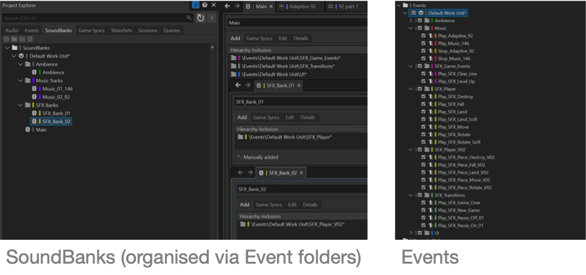
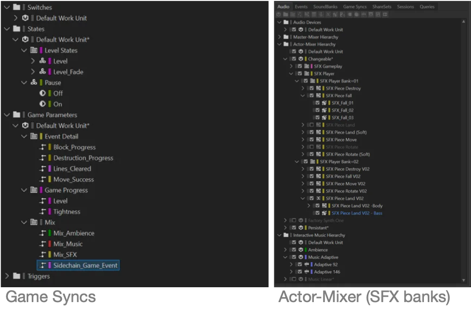
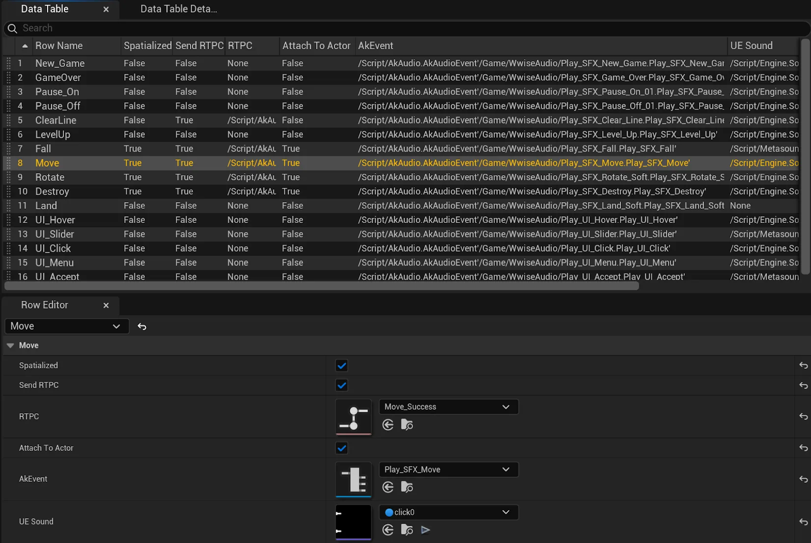
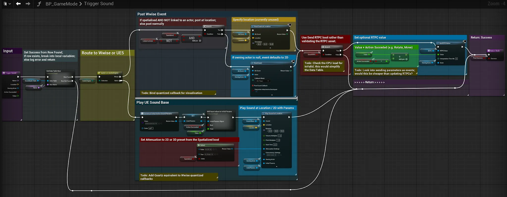
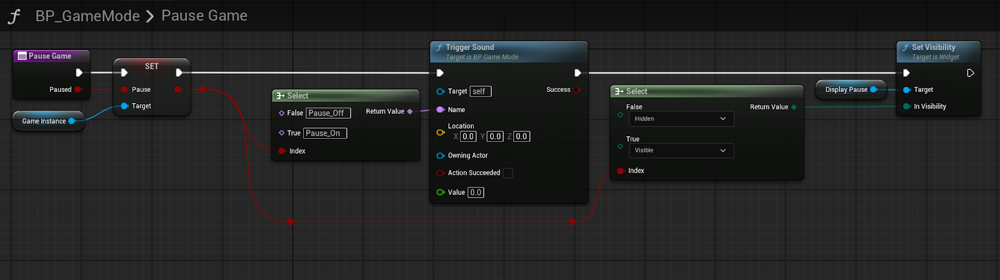
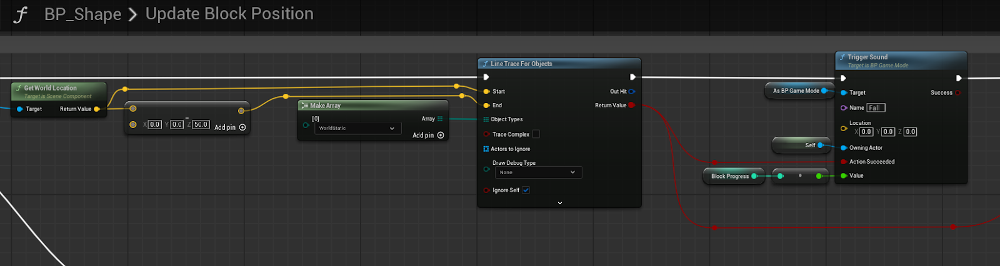
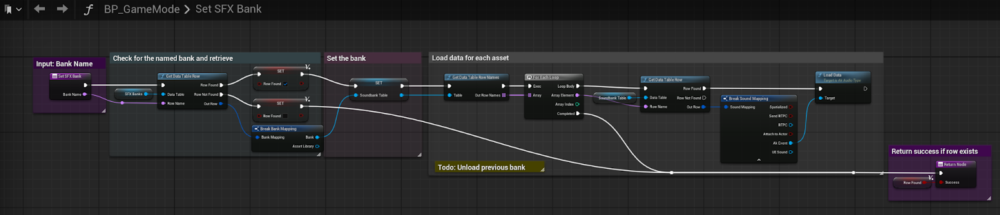
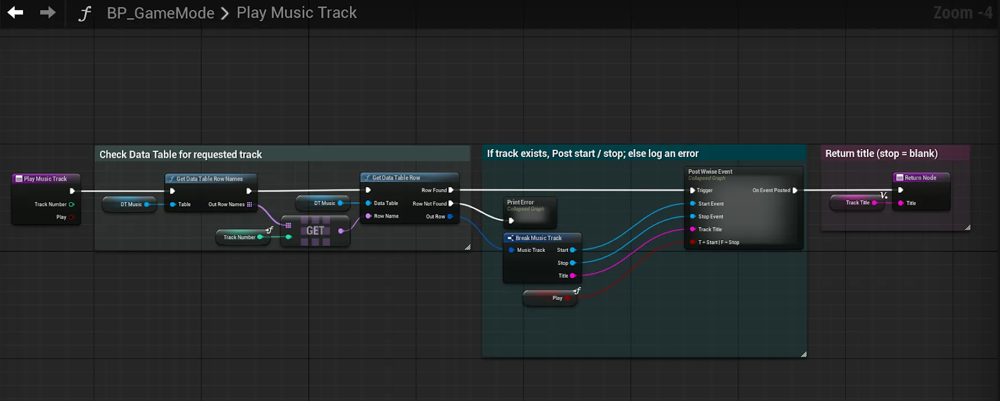
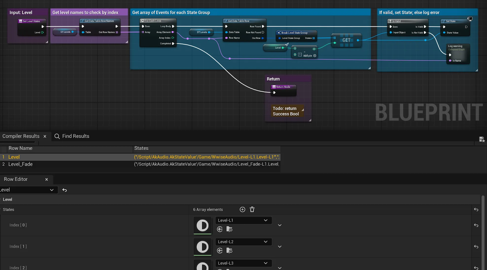

# Wwise / UE5 Demo Project: "Blocks"

**Charles Matthews 2025**

[matthewscharles.github.io/](http://matthewscharles.github.io/)

## Introduction

This is a draft for a dev log video / post describing audio implementation and Blueprint functionality for a project created in [Unreal Engine](https://www.unrealengine.com/) and [Wwise](https://www.audiokinetic.com/).

The project features an unofficial, non-commercial clone of Tetris, created solely for educational and demonstration purposes. It is intended as a vehicle for showcasing interactive audio implementation techniques and does not replicate or redistribute original assets, code, or proprietary content from the original game.

All trademarks and copyrights remain the property of their respective owners. If you are a rights holder and believe this content infringes on your intellectual property, please contact me and it will be promptly removed.

### Demo Video

The following video shows gameplay with timestamps for musical levels and transitions:

[Wwise Adaptive Music System: Blocks Demo](https://www.youtube.com/watch?v=Cw2E2UDpvCo)

<iframe src="https://www.youtube.com/embed/Cw2E2UDpvCo" style="position: absolute; top:0; left: 0; width: 100%; height: 100%;" frameborder="0" allowfullscreen></iframe>

Please see the inline screenshots for Blueprint examples (click for full-size images).

## Overview

The idea was to create a game that would be playable from start to finish, with some clear parameters for progression and tension as a vehicle for sound effects and interactive music. Having cloned an existing game to work through the structure, the next iteration should be a playable standalone with original logic suitable for upload on itch.io. 

The project started from a YouTube tutorial ([@BuildGamesWithJon](https://www.youtube.com/watch?v=54L7Un47Pbs)) with heavy modifications; all original blueprints have now been replaced. 

**Key modifications and features:**\- Game logic and globally accessible variables decoupled from the block blueprint and moved to the Player Controller, Game Mode, and Game Instance singletons

- Hard-coded block configurations and colours replaced with structs
- Moved from trigger boxes to a 1D array-based grid
- Added scoring system including 
- Added Widgets for pause, options, and music, including gamepad controls with audio feedback
- Added an audio manager based on Data Tables – minimum inline references to assets
- Added a music system to mix between tracks – currently four simultaneous stems

## Wwise Hierarchy

Although the game exists on a single map without world partitioning, different SoundBanks can be loaded by the player through the pause and option screens.

The current Windows version of the project uses the default 256 concurrent voices. 

Priorities are set for consistency on the central rhythmic "falling" sound and game events. Minor details such as individually spatialised sounds for the destruction of blocks are set to low priority, and limited to ten simultaneous instances.

## Memory and loading SoundBanks

Auto-generated SoundBanks have been turned off, as these did not seem appropriate due to the size of potentially concurrently loaded clips in the interactive music hierarchy. 

At present, the player can switch tracks by pressing the track skip buttons found on the pause screen. 
Initial tests with the profiler indicated that dynamically loading the music tracks reduced memory, but also produced performance issues including music and SFX dropouts. 

As a temporary measure, the music SoundBanks are currently loaded into memory by default in this version, with memory use at around 200MB at runtime – fine for a proof of concept in a music-oriented game, but not acceptable for production.
Since the player can enter the music at different level states, it is not possibly simply to stream the first section of the music, and streaming all stems may cause further performance issues.

I am currently working on a solution to load the music tracks dynamically. Potential solutions:Streaming all stems by default (requires testing, not viable for mobile)Streaming a lead-in clip on the transition **none->any** to allow time for the main tracks to bufferSeparating the first portion of each section into a shorter streamable segmentLoading or partially loading the "previous" and "next" Soundbanks when the player approaches the boundary.

Simplified music options may be necessary more generally for a future mobile version.Audio ManagerThe audio manager is temporarily located in the game mode to remain accessible across UMAPs, but should be moved to the game instance or game state.

All events are stored in Data Tables to avoid hard-coding values, allowing events to be dropped directly into a soundbank preset table from the Wwise Browser. At present, a new Data Table should be generated for each SoundBank – this should be possible to automate with scripting via the WAAPI.

The Game Mode exposes a Trigger Sound function, which determines what kind of event should be posted by cross-referencing values from the input parameters and information from the table entry.

This also provides the opportunity to switch dynamically between Wwise and UE's built-in audio system – the two approaches can also be combined using the Audio Link system so that any built-in UE sources can be summed through a Wwise mix bus.

The following Blueprint functions show example calls to Trigger Sound, with and without spatialisation:

A higher level Data Table allows for switching between the respective SoundBanks and Data Tables. The following blueprint function appears to work subject to further testing; **Auto Load** should be set to **Off** for each file in the UE5\Content\WwiseAudio folder (otherwise set to **On** by default). 

## Mix

The top level bus hierarchy in Wwise is matched by Sound Submixes in native UE, creating Music, Ambience, and SFX channels for the purposes of a user-modifiable mix from the options screen.

Slider widgets post RTPCs to Wwise alongside modulation parameters for the native buses. MusicTracks are stored as Wwise "start" and "stop" events in a data table, and can be retrieved by index or track title. 

Since all music is currently handled by Wwise, the Play Music Track function simply checks if the entry is present and posts a play/stop event. The function should also be updated to load data for each asset as in **Set SFX Bank**.

Each adaptive music track lives on a Music Switch, with sections assigned to gameplay levels. Sections vary from 8 - 32 bars, meaning that the player can level-up multiple times before the boundary of a musical section.

In order to create transitions between longer loops, multiple Wwise States are set simultaneously, each configured with individual quantization points and fade times at the levels of Audio Bus, Switch Group, and Music Segment. As a result, a long pre-entry section can also be used to trigger a "dub" section based on level switches on the material currently being played.

To handle this potentially complex setup in UE, arrays of Wwise States are stored as Data Tables so that parallel events can be added and called without modifying the Blueprints. 

This setup offers potential for selectively triggering layers – for example, enabling simplified transitions by only triggering the events associated with the main music switch.

A basic ambience track is also generated by overlapping loops on a Music Switch. The ambience control affects the volume of this track alongside a reverb return bus.

## Conclusion

The project cooks and builds successfully in Windows. 

After testing, storage of assets in Data Tables does not appear to affect the SoundBank loading situation, so it appears to be a practical design pattern / architecture.

### Next steps

- **Test and confirm dynamic Soundbank loading**  
  - Test on Mac  
  - Identify further cooking prep  
  - Test the current bank-loading solution on the interactive music hierarchy  
  - Expand the number of interactive music tracks to emulate a larger scale game  
- **Refactor and optimise the UE5 project:**   
  - Move the logic from the Game Mode to help allow for a future multiplayer version  
  - Move globally accessible variables from the Game Mode and Instance to the Game State 
  - Add Wwise callbacks for visual feedback from the music transitions  
  - Swap remaining hardcoded structs for Data Tables and Data Assets  
  - Validate assets where appropriate  
- **Refine and optimise the Wwise project:**   
  - Move from RTPCs to switches where possible  
  - Establish consistent naming conventions  
  - Add custom cues for callbacks to the Blueprint  
  - Add static music options for low-power platforms / mobile  
- **Add game improvements via UE**  
  - Enhance general playability including wall kicks, delays on landing and line clearing, save top score – and ideally replace the logic with original gameplay for a public upload  
  - Refine menu system, both visually and in terms of gamepad navigation