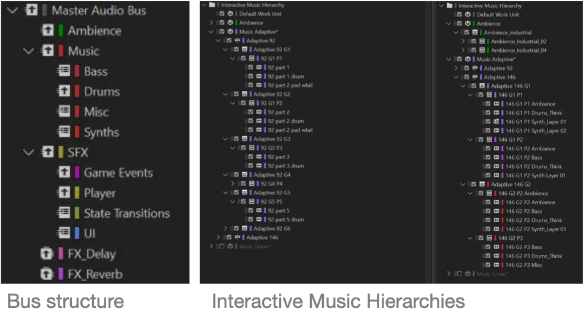

**Charles Matthews 2025** | [matthewscharles.github.io](http://matthewscharles.github.io/)

## Table of Contents

- [Introduction](#introduction)
  - [Demo Video](#demo-video)

- [Overview](#overview)
  - [Key features](#key-features)

- [Wwise Hierarchy](#wwise-hierarchy)
- [SoundBanks and Memory Management](#soundbanks-and-memory-management)
- [Audio Manager](#audio-manager)
- [Mix](#mix)

- [Conclusion](#conclusion)
  - [Next steps](#next-steps)

## Introduction

This devlog describes audio implementation and Blueprint functionality for a project created in [Unreal Engine](https://www.unrealengine.com/) and [Wwise](https://www.audiokinetic.com/).  While the focus is on audio, the aim is also to develop and demonstrate general skills within the engine.

The project in question features an unofficial, non-commercial clone of Tetris, created solely for educational and demonstration purposes. It is intended as a vehicle for showcasing interactive audio implementation techniques and does not replicate or redistribute original assets, code, or proprietary content from the original game.

All trademarks and copyrights remain the property of their respective owners. If you are a rights holder and believe this content infringes on your intellectual property, please contact me and it will be promptly removed.

### Demo Video

The following video shows gameplay with YouTube timestamps for musical levels and transitions:

[Wwise Adaptive Music System: Blocks Demo](https://www.youtube.com/watch?v=Cw2E2UDpvCo)

<iframe src="https://www.youtube.com/embed/Cw2E2UDpvCo" style="position: absolute; top:0; left: 0; width: 100%; height: 100%;" frameborder="0" allowfullscreen></iframe>

Please see the inline screenshots for Blueprint examples (click for full-size images).

## Overview

The goal was to create a game that would be playable from start to finish, with some clear parameters for progression and tension as a vehicle for sound effects and interactive music. A puzzle game felt like the best option for something self contained, and also provided the opportunity to explore mechanics outside the usual 3D character-based projects that I have worked on in previous demos.

Having cloned an existing game to work through the structure, the next iteration should be a playable standalone with original logic, suitable for upload on itch.io. 

### Starting point

I began with a YouTube tutorial by [@BuildGamesWithJon](https://www.youtube.com/watch?v=54L7Un47Pbs), using it as a starting point before applying significant modifications. My focus was on improving separation of concerns and shifting toward a more data-driven architecture.

At this stage, all Blueprints and assets from the original tutorial have been replaced with custom implementations.

### **Key features**

- Game logic and  variables decoupled from the "block" blueprint, and moved to common singletons: Player Controller, Game Mode, and Game Instance.
- Hard-coded block configurations from the original tutorial replaced with structs
- Moved from trigger boxes to a more conventional grid stored in a 1D array
- Added a scoring system and audio/visual feedback for events and progression through the levels
- Incorporated UMG Widgets for pause, options, and music, including gamepad controls with audio feedback
- Integrated a music system to mix between tracks
- Added an audio manager based on [Data Tables](https://dev.epicgames.com/community/learning/tutorials/Gp9j/working-with-data-in-unreal-engine-data-tables-data-assets-uproperty-specifiers-and-more), minimising inline references to assets

## Wwise Hierarchy

Although the game exists on a single map without world partitioning, the different SoundBanks can be loaded explicitly by the player via the pause and option screens.

  
Wwise hierarchy screenshots (click to expand)

  

    
  

  

    
  

  

    
  

The project currently uses the default 256 concurrent voices. 

Priorities are set for consistency on the central rhythmic "falling" sound and game events. Minor details such as individually spatialised sounds for the destruction of blocks are set to low priority, and limited to ten simultaneous instances.

## Audio Manager

Wwise Events and UE Sounds are typically triggered directly from Blueprints, which can result in asset references being distributed throughout the game logic. While this direct referencing approach is often sufficient, it can become harder to maintain at scale.

A globally accessible audio manager helps consolidate audio logic and control, reducing the number of Blueprints an audio designer needs to interact with. This centralization improves debugging stability and supports more scalable workflows.

While an audio manager is typically implemented as a singleton — for example, via a GameInstanceSubsystem or dedicated manager class — this prototype uses Blueprint-callable functions on the Game Mode to achieve global access across UMAPs.

All Wwise Events are stored in Data Tables to avoid hard-coded references in Blueprints. Instead of embedding asset references directly, events are organized in a centralized SoundBank preset table. These are dropped in directly from the Wwise Browser, as shown below:

### Accessing Data Tables: *Trigger Sound*

The Game Mode exposes a *Trigger Sound* function, which determines what kind of event should be posted by cross-referencing values from the input parameters and information from the table entry.  

In Wwise terms, this is similar to the standard *Post Event* and *Set RTPC* nodes, but with added flexibility for layering game syncs that may be attached to an actor.  

Posting a sound using the built-in UE *MetaSounds* can be more complex, involving presets, initial parameters, and in some cases requiring interaction with the Builder API. 

- [Trigger Sound on BlueprintUE.com](https://blueprintue.com/blueprint/j7hemlh-/)

In this prototype, *Trigger Sound* takes a *success* bool (e.g. whether a rotation or move was successful), and a generic float called *value*.  These values are combined to generate a single RTPC value that can be sent alongside the event.

A better approach might be to pass a custom structure to the *Trigger Sound* function, allowing the designers to include a flexible list of parameters at either end.

The following Blueprint functions show example *Trigger Sound* calls:

Although it is unusual to use both Wwise and the built-in UE audio in a single project, this provides an example of how a single function can be deployed and edited centrally as the needs of the game evolve. 

For example, if built into the design early on, the audio manager could provide a way to migrate a project from Wwise to built-in audio and vice versa.

### Switching SoundBanks

In this version, a new Data Table should be generated manually to accompany each alternative SFX SoundBank, which essentially means duplicating assignments in Wwise. Although this would not be practical at a larger scale, it should be possible to automate the Data Table generation with WAAPI scripting.

A higher level Data Table facilitates switching between the respective SoundBanks and Data Tables. The following Blueprint function is a first attempt at ensuring dynamic switching, subject to further testing (n.b. *Auto Load* should be set to **Off** for the corresponding assets in *UE5\Content\WwiseAudio*). 

As well as providing a centralised container for assets, this Data Table-based approach also enables switching dynamically between Wwise and UE's built-in audio system while keeping the main Blueprints uncluttered.  

The built-in UE sources can be summed through a Wwise mix bus using [Audio Link](https://www.audiokinetic.com/en/blog/how-to-use-audiolink/), as implemented in this demo: [Sink the Drum Machine](https://www.youtube.com/watch?v=JACIFoUdL-o).

## Mix

The top level bus hierarchy in Wwise is matched by Sound Submixes in native UE, creating *Music*, *Ambience*, and *SFX* channels for a user-modifiable mix from the options screen.

UMG slider widgets post RTPCs to Wwise alongside modulation parameters for the native buses. Music tracks are stored as Wwise "start" and "stop" events in a Data Table, and can be retrieved by index or track title. 

Since all music is currently handled by Wwise, the *Play Music Track* function simply checks if the entry is present and posts a play/stop event. The function should also be updated to load data for each asset as in *Set SFX Bank*.

A basic ambience track is also generated by overlapping loops on a Music Switch. The *Ambience* control affects the volume of this track alongside a reverb return bus.

## Music Switches for Levels

Each adaptive music track lives on a Wwise Music Switch, with sections assigned to gameplay levels. Sections vary from 8 - 32 bars, meaning that the player can level-up multiple times before the boundary of a musical section.

In order to create transitions between longer loops, multiple Wwise States are set simultaneously.  Each state group is configured with individual quantization points and fade times for Audio Bus, Switch Group, and Music Segment. 

As a result, a long pre-entry section can also be used to trigger a "dub" section based on level switches on the material currently being played.

To handle this potentially complex setup in UE, arrays of Wwise States are stored as Data Tables so that parallel events can be added and called without modifying the Blueprints. 

This setup offers potential for selectively triggering layers – for example, enabling simplified transitions by only triggering the events associated with the main music switch.

## SoundBanks and Memory Management

The player can switch tracks by pressing the *track skip* buttons found on the pause screen; the music enters immediately at the current level state. 

Auto-generated SoundBanks are not appropriate due to the size of concurrently loaded clips in the interactive music hierarchy. Initial tests with the profiler indicated that dynamically loading the music tracks reduced memory, but also produced performance issues including music and SFX dropouts. 

As a temporary measure, the music SoundBanks are currently loaded into memory by default, with memory use at around 200MB at runtime. This is fine for a proof of concept in a music-oriented game, but would generally not be acceptable for production.

I am currently working on loading the music tracks dynamically. 

**Potential solutions:**

- Streaming all stems by default (requires testing, not viable for mobile)
- Streaming a lead-in clip on the transition **none->any** to allow time for the main tracks to buffer
- Separating the first portion of each section into a shorter streamable segment
- Loading or partially loading the "previous" and "next" Soundbanks when the player approaches the boundary (in this case, opening the music settings).

## Conclusion

The project cooks and builds successfully in Windows. The Data Table approach tests well so far, so it appears to be worth pursuing.

### Next steps

- **Test and confirm dynamic Soundbank loading**  
  - Test on other platforms including Mac  
  - Identify further cooking prep  
  - Test the current bank-loading solution on the interactive music hierarchy  
  - Expand the number of interactive music tracks to emulate a larger scale game  
- **Refactor and optimise the UE5 project:**   
  - Move logic from the Game Mode to help allow for a future multiplayer version  
  - Move globally accessible variables from the Game Mode and Instance to the Game State 
  - Create a dedicated Audio Manager singleton rather than using the Game Mode
  - Determine a more flexible input for the *Trigger Sound* function, e.g. passing a struc.
  - Add Wwise callbacks for visual feedback from the music transitions  
  - Swap any remaining hard-coded structs for Data Tables and Data Assets  
  - Ensure assets are validated where appropriate  
- **Refine and optimise the Wwise project:**   
  - Move from RTPCs to switches where appropriate  
  - Establish consistent naming conventions  
  - Add custom cues for callbacks to the Blueprint  
  - Add static music options for low-power platforms / mobile  
- **Add game improvements via UE**  
  - Enhance general playability including wall kicks, delays on landing and line clearing, save top score – and ideally replace the logic with original gameplay for a public upload  
  - Refine menu system, both visually and in terms of gamepad navigation